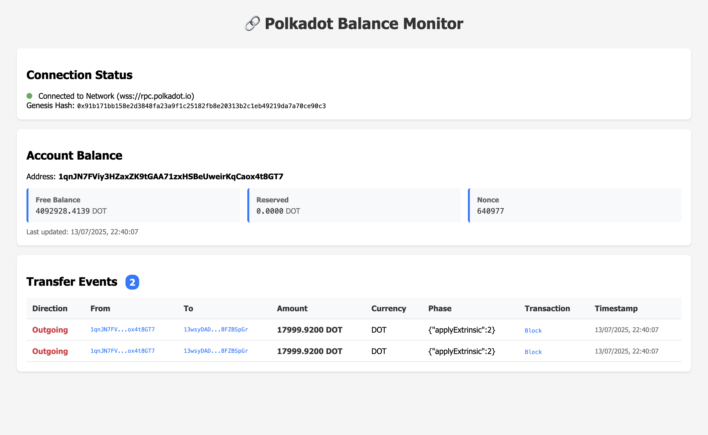

# 📊 Polkadot Token Tracker


A native token tracker for **Substrate-based chains**, specifically for tracking the **DOT token** (or other native tokens). This tool lets you monitor the real-time balance of any address by connecting to a specified RPC endpoint.

---

## 🚀 Features

- Real-time balance tracking for Substrate-based chains (e.g., Polkadot, Kusama)
- Cross-platform GUI support
- Run as a native executable or via Docker in a web-based VNC
- Lightweight and easy to set up

---

# 🧪 Demo

## Run directly from OS

```sh
cp .env.example .env 
npm i
npm run start
```

This will run the application as an executable.


https://github.com/user-attachments/assets/e4a45576-4ca6-4440-88cd-c63e4dffb02c


A demo of the version directly on OS

## Run via docker

Since it's an executable with GUI, we run this via a web-based VNC (Virtual Network Computing)

```sh
docker compose up -d
```

After successfully being built, head over to URL [http://localhost:6080](http://localhost:6080) and click connect. 


https://github.com/user-attachments/assets/d48b6324-05c9-4839-a21e-da35e7f58bee
